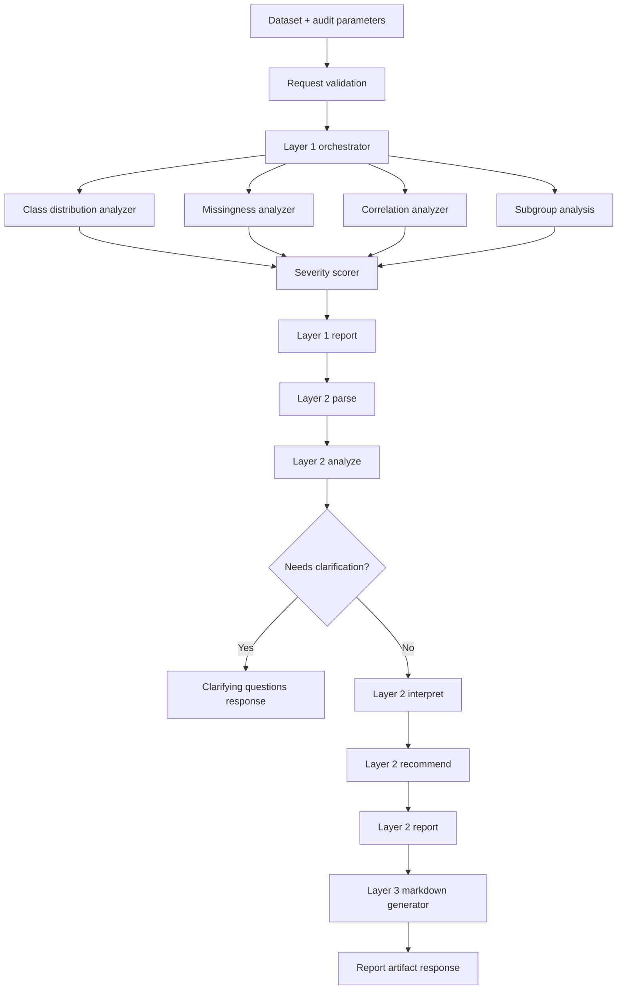

# Architecture

## System Overview

AuditLens evaluates tabular datasets for potential bias in a deterministic pipeline.

Layer status:
- Layer 1: statistical audit (implemented)
- Layer 2: task-aware interpretation (implemented)
- Layer 3: report generation (in progress)

## Key Components

- [`backend/main.py`](./backend/main.py): FastAPI app bootstrap and router wiring.
- [`backend/routers/audit.py`](./backend/routers/audit.py): request validation and audit endpoint.
- [`backend/layer1/audit.py`](./backend/layer1/audit.py): orchestrates analyzers into one report.
- [`backend/layer1/class_distribution.py`](./backend/layer1/class_distribution.py): target class imbalance checks.
- [`backend/layer1/missing_values.py`](./backend/layer1/missing_values.py): missingness checks across groups.
- [`backend/layer1/correlations.py`](./backend/layer1/correlations.py): sensitive-to-target correlation checks.
- [`backend/layer1/subgroup_analysis.py`](./backend/layer1/subgroup_analysis.py): subgroup outcome and parity checks.
- [`backend/layer1/severity_scorer.py`](./backend/layer1/severity_scorer.py): severity assignment and issue ranking.
- [`backend/utils/schema.py`](./backend/utils/schema.py): report schema.
- [`backend/utils/config.py`](./backend/utils/config.py): thresholds and sorting configuration.
- [`backend/layer2/agent.py`](./backend/layer2/agent.py): Layer 2 orchestration entrypoint.
- [`backend/layer2/nodes/`](./backend/layer2/nodes/): parse/analyze/clarify/interpret/recommend/report pipeline nodes.
- [`backend/layer2/llm/`](./backend/layer2/llm/): provider abstraction for OpenAI/Groq-compatible clients.
- [`backend/layer3/report_generator.py`](./backend/layer3/report_generator.py): markdown report assembly for delivery.

## Data Flow

1. Client submits dataset with target and sensitive column config.
2. Router validates and normalizes request input.
3. Layer 1 orchestrator executes analyzers.
4. Findings are scored and sorted by severity.
5. Layer 2 (via `/analyze-task` or `/analyze-task-report`) runs parse -> analyze -> clarify/interpret -> recommend -> report.
6. API returns clarification questions or a structured task-aware report.
7. Layer 3 (via `/analyze-task-report`) generates shareable Markdown from final Layer 2 output.

## Diagram

