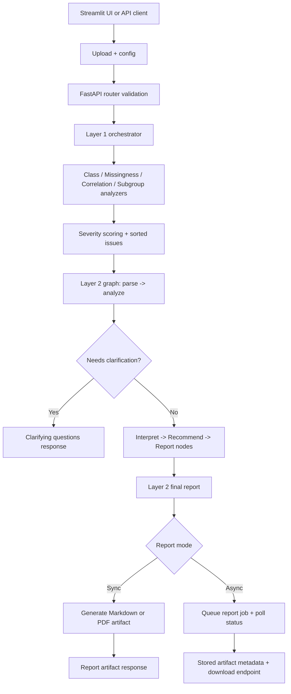

# Architecture

## System Overview

AuditLens is a layered bias-audit system for tabular data.

Layer status:
- Layer 1: statistical audit (implemented)
- Layer 2: task-aware interpretation (implemented)
- Layer 3: report generation, artifact storage, and async jobs (implemented)
- Frontend: Streamlit UI for upload, configuration, clarification flow, and downloads

## Key Components

- [`server/auditlens_server/app.py`](./server/auditlens_server/app.py): FastAPI app bootstrap and router wiring.
- [`server/auditlens_server/routers/audit.py`](./server/auditlens_server/routers/audit.py): request validation and API endpoints.
- [`src/auditlens/api.py`](./src/auditlens/api.py): public `audit()` entrypoint and `AuditLensReport` wrapper.
- [`src/auditlens/core/audit.py`](./src/auditlens/core/audit.py): orchestrates Layer 1 analyzers into one report.
- [`src/auditlens/core/analyzers/`](./src/auditlens/core/analyzers/): class distribution, missingness, correlations, subgroup parity.
- [`src/auditlens/core/severity.py`](./src/auditlens/core/severity.py): severity assignment helpers.
- [`src/auditlens/core/schema.py`](./src/auditlens/core/schema.py): HTTP / Layer 1 Pydantic models.
- [`src/auditlens/config.py`](./src/auditlens/config.py): thresholds, Layer 2 env-driven settings.
- [`src/auditlens/interpretation/pipeline.py`](./src/auditlens/interpretation/pipeline.py): Layer 2 LangGraph invoke entrypoint.
- [`src/auditlens/interpretation/graph.py`](./src/auditlens/interpretation/graph.py): LangGraph wiring.
- [`src/auditlens/interpretation/nodes/`](./src/auditlens/interpretation/nodes/): parse/analyze/clarify/interpret/recommend/report nodes.
- [`src/auditlens/interpretation/llm/`](./src/auditlens/interpretation/llm/): `BaseLLMClient`, factory, OpenAI-compatible providers.
- [`src/auditlens/interpretation/schema.py`](./src/auditlens/interpretation/schema.py): Layer 2 Pydantic models.
- [`src/auditlens/reporting/generator.py`](./src/auditlens/reporting/generator.py): Markdown/PDF report assembly.
- [`src/auditlens/reporting/visualizations.py`](./src/auditlens/reporting/visualizations.py): chart generation for reports and UI.
- [`src/auditlens/reporting/artifacts.py`](./src/auditlens/reporting/artifacts.py): artifact persistence and metadata.
- [`src/auditlens/reporting/jobs.py`](./src/auditlens/reporting/jobs.py): async report job store and worker execution.
- [`ui/auditlens_ui/app.py`](./ui/auditlens_ui/app.py): Streamlit entrypoint.
- [`ui/auditlens_ui/ui.py`](./ui/auditlens_ui/ui.py): Streamlit rendering and interactions.
- [`ui/auditlens_ui/workflow.py`](./ui/auditlens_ui/workflow.py): UI orchestration for sync/async runs.
- [`ui/auditlens_ui/api_client.py`](./ui/auditlens_ui/api_client.py): HTTP API client and error mapping.

## Data Flow

1. User uploads CSV and configures audit in Streamlit UI or via API.
2. Router validates input and normalizes selected sensitive columns.
3. Layer 1 computes deterministic statistical issues and severity ranking.
4. Layer 2 runs graph nodes: parse -> analyze -> (clarify or interpret) -> recommend -> report.
5. If context is ambiguous, API returns clarification questions and partial task context.
6. On completion, Layer 3 generates report artifacts (Markdown or PDF).
7. Optional async report job path stores result payload and artifact metadata for polling/download.

## Diagram

