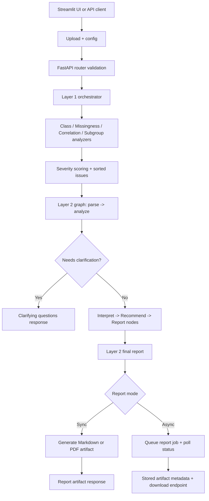

# Architecture

## System Overview

AuditLens is a layered bias-audit system for tabular data.

Layer status:
- Layer 1: statistical audit (implemented)
- Layer 2: task-aware interpretation (implemented)
- Layer 3: report generation, artifact storage, and async jobs (implemented)
- Frontend: Streamlit UI for upload, configuration, clarification flow, and downloads

## Key Components

- [`backend/main.py`](./backend/main.py): FastAPI app bootstrap and router wiring.
- [`backend/routers/audit.py`](./backend/routers/audit.py): request validation and API endpoints.
- [`backend/layer1/audit.py`](./backend/layer1/audit.py): orchestrates analyzers into one report.
- [`backend/layer1/class_distribution.py`](./backend/layer1/class_distribution.py): target class imbalance checks.
- [`backend/layer1/missing_values.py`](./backend/layer1/missing_values.py): missingness checks across groups.
- [`backend/layer1/correlations.py`](./backend/layer1/correlations.py): sensitive-to-target correlation checks.
- [`backend/layer1/subgroup_analysis.py`](./backend/layer1/subgroup_analysis.py): subgroup outcome and parity checks.
- [`backend/layer1/severity_scorer.py`](./backend/layer1/severity_scorer.py): severity assignment and issue ranking.
- [`backend/utils/schema.py`](./backend/utils/schema.py): report schema.
- [`backend/utils/config.py`](./backend/utils/config.py): thresholds and sorting configuration.
- [`backend/layer2/agent.py`](./backend/layer2/agent.py): Layer 2 orchestration entrypoint.
- [`backend/layer2/nodes/`](./backend/layer2/nodes/): parse/analyze/clarify/interpret/recommend/report pipeline nodes.
- [`backend/layer2/llm/`](./backend/layer2/llm/): provider abstraction for OpenAI/Groq/OpenRouter-compatible clients.
- [`backend/layer3/report_generator.py`](./backend/layer3/report_generator.py): Markdown/PDF report assembly.
- [`backend/layer3/visualizations.py`](./backend/layer3/visualizations.py): chart generation for reports and UI.
- [`backend/layer3/artifact_store.py`](./backend/layer3/artifact_store.py): artifact persistence and metadata.
- [`backend/layer3/report_jobs.py`](./backend/layer3/report_jobs.py): async report job store and worker execution.
- [`frontend/app.py`](./frontend/app.py): Streamlit entrypoint.
- [`frontend/ui.py`](./frontend/ui.py): Streamlit rendering and interactions.
- [`frontend/workflow.py`](./frontend/workflow.py): frontend orchestration for sync/async runs.
- [`frontend/api_client.py`](./frontend/api_client.py): backend API client and error mapping.

## Data Flow

1. User uploads CSV and configures audit in Streamlit UI or via API.
2. Router validates input and normalizes selected sensitive columns.
3. Layer 1 computes deterministic statistical issues and severity ranking.
4. Layer 2 runs graph nodes: parse -> analyze -> (clarify or interpret) -> recommend -> report.
5. If context is ambiguous, API returns clarification questions and partial task context.
6. On completion, Layer 3 generates report artifacts (Markdown or PDF).
7. Optional async report job path stores result payload and artifact metadata for polling/download.

## Diagram

