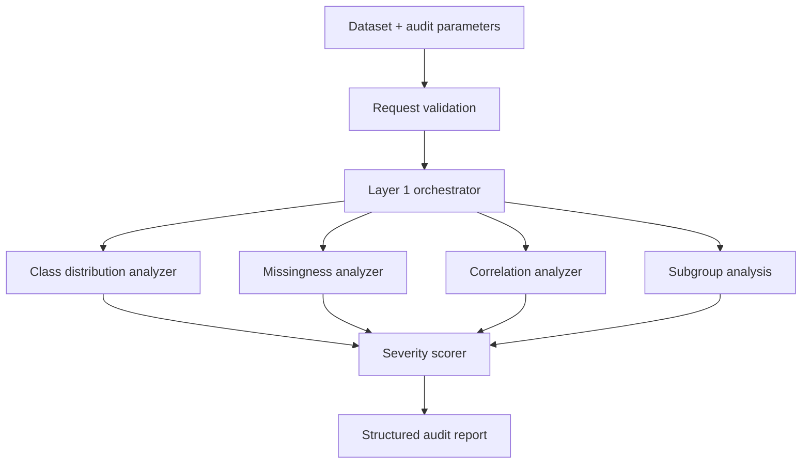

# Architecture

## System Overview

AuditLens evaluates tabular datasets for potential bias in a deterministic pipeline.

Layer status:
- Layer 1: statistical audit (implemented)
- Layer 2: task-aware interpretation (planned)
- Layer 3: report generation (planned)

## Key Components

- `backend/main.py`: FastAPI app bootstrap and router wiring.
- `backend/routers/audit.py`: request validation and audit endpoint.
- `backend/layer1/audit.py`: orchestrates analyzers into one report.
- `backend/layer1/class_distribution.py`: target class imbalance checks.
- `backend/layer1/missing_values.py`: missingness checks across groups.
- `backend/layer1/correlations.py`: sensitive-to-target correlation checks.
- `backend/layer1/subgroup_analysis.py`: subgroup outcome and parity checks.
- `backend/layer1/severity_scorer.py`: severity assignment and issue ranking.
- `backend/utils/schema.py`: report schema.
- `backend/utils/config.py`: thresholds and sorting configuration.

## Data Flow

1. Client submits dataset with target and sensitive column config.
2. Router validates and normalizes request input.
3. Layer 1 orchestrator executes analyzers.
4. Findings are scored and sorted by severity.
5. API returns a structured audit report.

## Diagram

