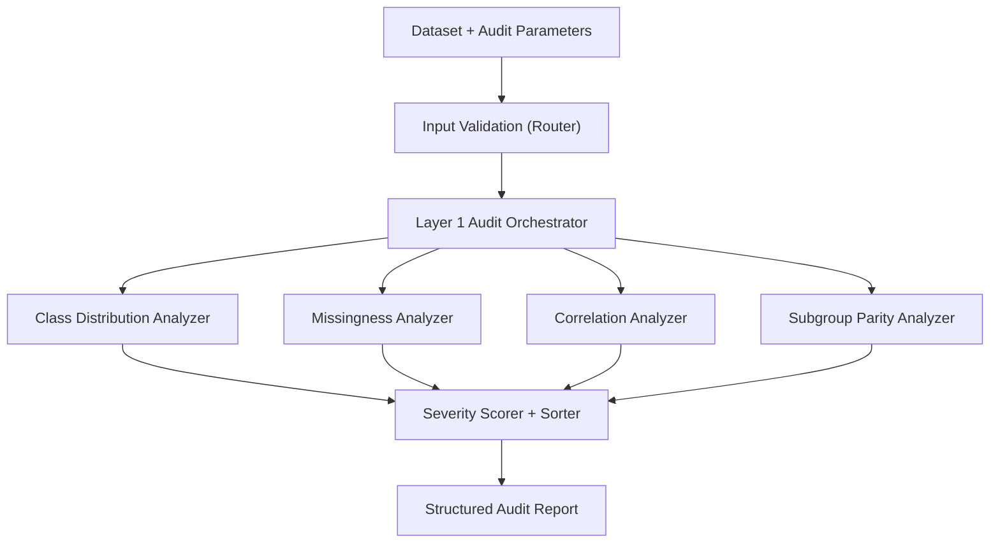

# Architecture

## System Overview

AuditLens evaluates tabular datasets for potential bias in a structured, deterministic way.

Current implementation focuses on Layer 1 (statistical audit):
- Input ingestion and validation
- Analyzer execution
- Severity scoring and issue ranking
- Structured report output

The long-term architecture is 3-layer:
- Layer 1: Statistical audit (implemented)
- Layer 2: Task-aware interpretation (planned)
- Layer 3: Report generation (planned)

## Key Components

- `backend/main.py`
  - Application bootstrap and router registration.
- `backend/routers/audit.py`
  - Accepts dataset input and user parameters.
  - Performs validation and triggers audit execution.
- `backend/layer1/audit.py`
  - Orchestrates all analyzers and returns a single report payload.
- `backend/layer1/*.py`
  - Individual analyzers for class balance, missingness, correlation, and subgroup parity.
- `backend/layer1/severity_scorer.py`
  - Applies threshold-based severity rules and summary counts.
- `backend/utils/schema.py`
  - Defines structured output schema.
- `backend/utils/config.py`
  - Centralized thresholds and issue sort order.

## Data Flow

1. Dataset is uploaded with target and sensitive column context.
2. Input is validated and normalized.
3. Layer 1 analyzers run independently.
4. Findings are scored and sorted by severity.
5. Unified audit report is returned in structured form.

## Diagram

