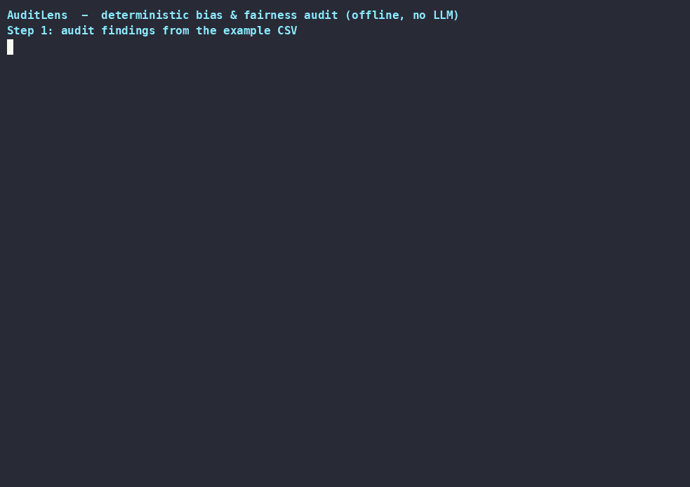

# AuditLens

> Deterministic, statistical bias and fairness auditing for tabular datasets. Findings with severity, before you trust any LLM read.

<p align="center"></p>

Watch the full demo: [demo.mp4](assets/demo/demo.mp4)

[](https://github.com/haseebraza715/AuditLens/actions/workflows/ci.yml)

## Why this exists

Fairness claims need evidence you can regenerate: a black-box score cannot be rerun, audited, or explained. AuditLens runs fixed statistical checks with fixed thresholds, so the same CSV always produces the same findings. The optional LLM layer reads only those statistics, never the raw data's interpretation.

## What it does

- **Deterministic statistical audit (always on).** Class-distribution imbalance, differential missingness by sensitive group, sensitive-column ↔ target correlation (Cramér's V, point-biserial, Spearman/Pearson), and subgroup demographic-parity gaps. No network, no API keys.
- **Severity model.** Every finding carries a `high`/`medium`/`low` level, the exact metric value, and a justification line, assigned from one threshold table (`src/auditlens/config.py`).
- **Shareable reports.** `auditlens report` writes markdown, HTML, and strict-JSON artifacts; the PDF export is byte-reproducible for identical inputs. The `auditlens` console script (and `python -m auditlens`) wraps the same `audit()` API used in notebooks and the server.
- **Optional LLM interpretation.** Providers `openai`/`groq`/`openrouter` explain findings on top of, never instead of, the statistics; provenance (provider, model, thresholds) is embedded in every report.
- **Optional server and UI.** FastAPI backend and Streamlit frontend as extras (`.[server]`, `.[ui]`).

## Architecture

```
examples/quickstart.csv
        │  auditlens audit ... (CLI, thin wrapper)   or   audit(df, ...) (library)
        ▼
  ┌─────────────────┐
  │ core/audit.py   │  validates inputs, orchestrates analyzers
  └────────┬────────┘
           ▼
  core/analyzers/       class_distribution · missing_values
                        correlations · subgroup_analysis
           ▼
  core/severity.py      fixed thresholds → severity + justification
           ▼
  reporting/generator.py · artifacts.py · jobs.py
  (markdown/PDF/HTML · JSON-safe serialization · async report jobs)
```

Module map: `src/auditlens/api.py` (public wrapper) · `core/` (orchestration, the four analyzers, severity thresholds in `config.py`) · `interpretation/` (optional LLM graph) · `reporting/` (markdown/PDF generators, artifact store, async jobs) · `cli.py` (thin wrapper) · `server/` `ui/` (optional apps).

## Quick start

```bash
python3 -m venv .venv && source .venv/bin/activate
pip install -e .
auditlens audit examples/quickstart.csv --sensitive group sex --target target
```

## Demo

```bash
./scripts/demo.sh        # or, recorded session: scripts/demo/record.sh
```

You'll see the audit detect two HIGH findings on the bundled 8-row CSV: a point-biserial correlation `|r| = 0.500` (n=8) between `sex` and the target, and a demographic-parity gap of `Δ = 0.500` (F=0.25 vs M=0.75). It writes markdown/HTML/JSON artifacts to `demo-output/`, fully offline: zero network, zero API keys, no LLM. The recorded demo (`assets/demo/demo.cast`) is regenerated from `scripts/demo/demo_body.sh`.

## Technical decisions

- **Cramér's V is clamped to [0, 1] with NaN-safe conventions.** `chi2_contingency` emits `inf`/`nan` on zero-expected cells; those tables are treated as perfectly determined (score 1.0), degenerate tables (fewer than two categories) score 0.0. Constant columns report zero correlation: an undefined statistic is not evidence of independence.
- **Non-finite metrics never become "low".** Severity scoring rejects `inf`/`nan` with an error (`src/auditlens/core/severity.py`), because labeling an undefined statistic low-risk would hide a broken computation.
- **PDFs are byte-reproducible.** ReportLab is built with `invariant=True`, suppressing embedded creation timestamps so identical inputs yield byte-identical PDFs.
- **JSON-safe serialization.** `inf`/`NaN` metrics are emitted as `null` in `AuditLensReport.to_dict()`, so any JSON consumer can parse reports without custom float handling.

## Validation

342 tests pass (`pytest tests`), including a synthetic known-bias dataset with planted findings and a byte-locked golden audit of the UCI Adult dataset (32,561 rows); `ruff check .` is clean on CI.

## Limitations

- Findings are effect-size screens, not significance tests or causal claims; on small samples a large gap carries wide sampling error, so validate on larger data before acting.
- Audits of `target ∈ sensitive` are rejected by design — a column correlating with itself is meaningless.
- Numeric-sensitive correlations rely on quantile binning when the target has many categories; associations within a bin can be missed.
- PDF charts cover Layer 1 aggregations only; no per-subgroup distribution plots.
- Severity thresholds are project defaults, not calibrated to any specific downstream task; they are a configuration surface, not a guarantee.
- The optional LLM layer is only as good as its provider — statistics always run first and are always reported.
